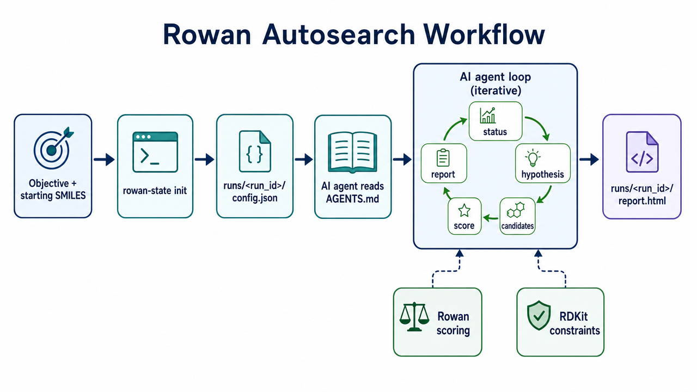
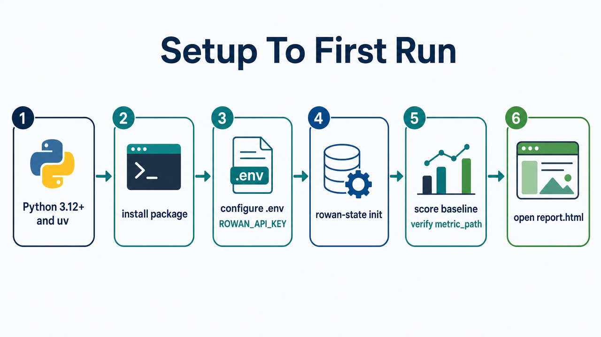
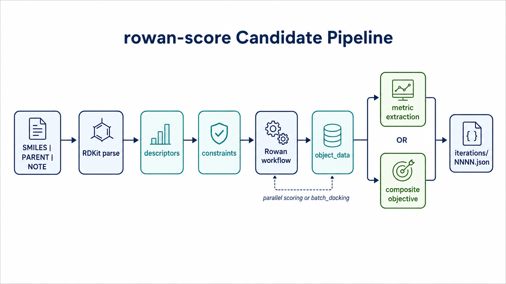
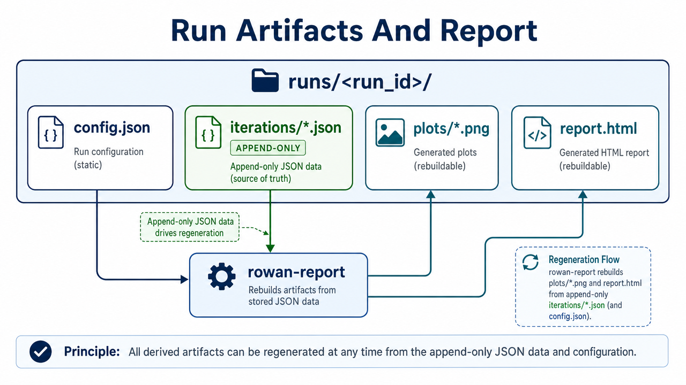
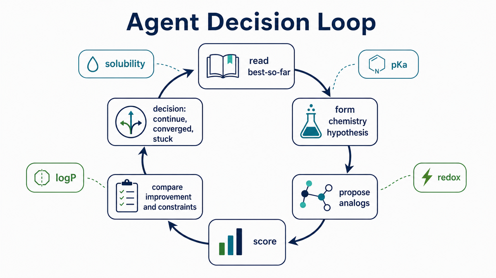

# Rowan Autosearch

[](https://x.com/k_dense_ai)
[](https://www.linkedin.com/company/k-dense-inc)
[](https://www.youtube.com/@K-Dense-Inc)

**Agent-driven molecular property optimization.** You define a chemistry
objective and a starting molecule. An AI coding agent (Claude Code, Cursor,
Codex, OpenCode, Gemini, etc.) plays the role of a medicinal chemist:
proposing analogs, scoring them with [Rowan](https://www.rowansci.com/)
quantum/ML workflows, checking drug-likeness with RDKit, and iterating until
a winning candidate emerges.

`rowan-autosearch` is the **scoring harness and lab notebook** the agent uses
to do this rigorously: every candidate, every Rowan payload, every constraint
check, and every design rationale is captured as append-only JSON and rendered
into an auditable HTML report.

Joint work between [K-Dense](https://www.k-dense.ai) and
[Rowan Scientific](https://www.rowansci.com/).

> Recommended driver models: **Claude Opus 4.8**, **GPT 5.5**, or
> **Gemini 3.1 Pro**. Any agent that can read `AGENTS.md` and call CLI tools
> will work.

> **Stay up to date:** Follow K-Dense on [X](https://x.com/k_dense_ai), [LinkedIn](https://www.linkedin.com/company/k-dense-inc), and [YouTube](https://www.youtube.com/@K-Dense-Inc) for release announcements, molecular optimization walkthroughs, and new Rowan workflow examples you can run with your own AI agent.

> 🎬 **New to running K-Dense skills with your agent?** [Getting Started with Scientific Agent Skills](https://youtu.be/ZxbnDaD_FVg) covers the agent setup this harness assumes.

---

## Who This Is For

- **Computational chemists** running iterative property optimization (logS,
  pKa, redox potential, logP/logD, BDE, descriptors, docking) without writing
  custom enumeration code.
- **Medicinal chemists** who want a chemistry-aware AI partner to brainstorm
  analogs, score them with reproducible quantum/ML methods, and keep an
  auditable trail.
- **Computational biologists** doing structure-based ligand design who want
  to drive Rowan batch docking against a defined pocket and track
  drug-likeness alongside docking score.
- **Method developers** who want a reproducible benchmark harness for new
  Rowan workflows or composite objectives.

If you can describe a molecule and a measurable goal in one sentence
("maximize logS while keeping MW < 250 and preserving the carboxylic acid"),
you can drive a run.

---

## What You Get

Each run produces:

- A versioned **`config.json`** pinning the objective, starting SMILES, Rowan
  workflow, metric extractor, constraints, and (optionally) a weighted
  composite objective.
- An **append-only iteration log** under `iterations/NNNN.json` capturing,
  per candidate: SMILES, parent SMILES, the agent's design note, RDKit
  descriptors (MW, logP, TPSA, HBD/HBA, rotatable bonds, heavy atoms,
  rings), constraint pass/fail, the extracted Rowan metric, the **full raw
  Rowan `object_data`** (for re-extraction or audit), and the workflow UUID.
- An **HTML report** (`report.html`) with: progress and best-so-far curves, a
  Pareto plot (score vs. MW), a 2D structure grid of top candidates, a
  parent-to-child genealogy diagram, candidate tables, per-iteration
  rationales, and a 3D view of the current winner.

Everything in `runs/<run_id>/` is plain JSON + PNG + HTML — easy to commit,
diff, share, or post-process.

---

## How The Loop Works



The agent is the optimizer. The CLI handles bookkeeping, parallel Rowan
submissions, metric extraction, constraint checking, and reporting. There is
**no built-in Bayesian optimizer or genetic algorithm** — that is intentional,
so the agent's chemical reasoning stays in the loop and on the record.

See [`AGENTS.md`](AGENTS.md) for the full driver protocol an agent follows,
and [`docs/agent-decision-loop.png`](docs/agent-decision-loop.png) for a
visual summary of the agent's continue / converged / stuck decision cycle.

---

## Features

### Rowan workflows supported

`rowan-score` calls `rowan.submit_<workflow_type>_workflow(...)` from the
Rowan v3 SDK. SMILES-first workflows that work out of the box:

| Workflow | Typical use |
| --- | --- |
| `solubility` | Aqueous / organic solubility (`logS`, `logS_25C`) |
| `pka` / `macropka` | Acid/base ionization tuning |
| `redox_potential` | Oxidation / reduction potential (batteries, dyes, redox catalysts) |
| `admet` | `logP`, `logD`, predicted solubility |
| `descriptors` | Cheap descriptor sweeps (`logP`, `tpsa`) |
| `bde` | Bond dissociation energies |
| `electronic_properties`, `fukui` | Frontier orbital, reactivity descriptors |
| `hydrogen_bond_basicity`, `hydrogen_bond_donor_acceptor_strength` | H-bond strength |
| `conformer_search`, `tautomer_search`, `solvent_dependent_conformers` | Conformational sampling |
| `nmr` | Predicted NMR shifts |
| `ion_mobility`, `membrane_permeability` | Transport-relevant properties |
| `multistage_optimization`, `scan`, `irc`, `strain` | Geometry / reaction-path workflows |
| `docking`, `batch_docking` | Structure-based scoring against a protein pocket |

Workflows that need extra non-SMILES inputs (proteins, pockets, ligand sets,
spin states, reaction endpoints) are reachable by passing those through
`--workflow-param` — see [Run configuration](docs/run-configuration.md).

### Workflow parameter passthrough

Any Rowan v3 SDK argument is exposed via repeatable `--workflow-param key=json_value`:

```bash
--workflow-param method=kingfisher
--workflow-param solvents='["water","ethanol"]'
--workflow-param temperatures='[298.15]'
--workflow-param protein=<rowan-protein-uuid>
--workflow-param pocket='[[0,0,0],[12,12,12]]'
--workflow-param exhaustiveness=8
```

Values parse as JSON when possible (lists, numbers, booleans), falling back to
strings. This is how you tune solubility methods, pKa methods, descriptor
solvents, docking pockets, exhaustiveness, etc., without editing Python.

### Metric extraction

For common workflows, `rowan-score` knows where the scalar lives in Rowan's
`object_data` payload (e.g. `solubilities.O.solubilities.0` for aqueous
`logS`). For anything else, pass `--metric-path <dot.path>`, or score the
baseline once and pin the path after inspecting the saved `object_data`.

### Composite (weighted) objectives

Mix Rowan-derived numbers and local RDKit descriptors into one scalar score.
Each term has a goal (`maximize`, `minimize`, or `target` with a numeric
target) and a weight:

```bash
--objective-term '{"name":"logS","path":"solubilities.O.solubilities.0","goal":"maximize","weight":1.0}' \
--objective-term '{"name":"mw","source":"local","metric":"mw","goal":"minimize","weight":0.01}'
```

Local metric sources: `mw`, `logp_crippen`, `tpsa`, `hbd`, `hba`, `rotb`,
`heavy_atoms`, `rings`. Per-term contributions are saved alongside the
combined score for full transparency.

### Local RDKit constraints (drug-likeness gates)

Constraints are checked *before* spending Rowan credits. A failing candidate
is logged as skipped and is not submitted. Use `--score-constraint-failures`
only when intentionally paying to characterize an out-of-bounds candidate; it
still does not count toward best-so-far.

```bash
--constraint mw_max=350      # molecular weight maximum (Da)
--constraint mw_min=150      # molecular weight minimum
--constraint logp_max=4      # Crippen logP maximum
--constraint logp_min=-1     # Crippen logP minimum
--constraint tpsa_max=140    # topological polar surface area max (Ų)
--constraint tpsa_min=20     # topological polar surface area min
--constraint hbd_max=5       # H-bond donors maximum
--constraint hba_max=10      # H-bond acceptors maximum
--constraint rotb_max=10     # rotatable bonds maximum
--constraint ha_max=40       # heavy atoms maximum
--constraint ha_min=8        # heavy atoms minimum
--constraint rings_max=5     # ring count maximum
```

These cover Lipinski/Veber-style filters; Rowan-output constraints (e.g.
"pKa must be 4–6") are handled by including them as composite objective
terms.

### Parallel scoring + batch docking

Non-batch workflows are submitted concurrently with a `ThreadPoolExecutor`
(`--max-workers <n>`). For `batch_docking`, the entire candidate list is
submitted as a single Rowan batch workflow, which is the right choice for
scoring large ligand sets against a fixed pocket.

### Brainstorming helper (`rowan-propose`)

When the agent runs out of ideas, RDKit-based mutation strategies generate
new SMILES variants:

- **`bioisostere`** — common medchem swaps (COOH↔tetrazole, COOH↔sulfonamide,
  OH↔NH₂, benzene↔pyridine/pyrimidine, methyl↔F/CF₃, …).
- **`scan-subst`** — aromatic H replacement with F, Cl, Br, Me, OMe, CF₃, CN,
  NO₂, NH₂.
- **`brics`** — RDKit BRICS fragment decomposition + recombination.
- **`all`** — all of the above.

Output is pre-formatted as `SMILES|PARENT|NOTE`; the agent should still
filter for chemical sense before scoring.

### Surrogate active-learning advisor (`rowan-suggest`)

A quantitative co-pilot that keeps the agent as the optimizer but stops it from
spending Rowan credits blind. It learns a cheap surrogate (Morgan-fingerprint
random forest by default, or a Tanimoto-kernel Gaussian process) from the
run's *own* scored history and uses it to:

- **dedup** candidate SMILES against molecules already evaluated (canonical
  SMILES match), so credits are never re-spent;
- **rank** proposals by **Expected Improvement** over the current best,
  direction-aware, with a predicted value and uncertainty for each;
- **annotate** novelty (Tanimoto distance to the evaluated set) and Bemis-Murcko
  scaffold, and filter out candidates that fail the run's RDKit constraints;
- **select** a chemically diverse top-k via MaxMin so the search does not
  collapse into one chemotype;
- **report its own trustworthiness** via cross-validated `R^2`/MAE, and fall
  back to pure novelty ranking (clearly labeled) when there is too little data
  to model.

It is entirely local — no Rowan calls — and emits paste-ready
`SMILES|PARENT|NOTE` lines for `rowan-score` (or structured `--json`). See
[`docs/active-learning.md`](docs/active-learning.md).

```bash
# Rank the agent's own proposals before scoring:
uv run rowan-suggest --run <run_id> \
  --candidate "<SMILES>|<PARENT>|<NOTE>" \
  --candidate "<SMILES>|<PARENT>|<NOTE>" \
  --top-k 4

# Or generate and rank in one shot from a parent:
uv run rowan-suggest --run <run_id> --from-parent "<parent>" \
  --strategy all --n 20 --top-k 4
```

### Auditable HTML report

`rowan-report` regenerates plots and `report.html` from scratch on demand:

- `progress.png` — score per iteration, with constraint-aware best-so-far
  trace.
- `pareto.png` — primary metric vs. MW (drug-likeness trade-off view).
- `grid.png` — top-K 2D structures.
- `genealogy.png` — parent-to-child edges across iterations, color-coded by
  improvement.
- `chemical_space.png` — 2D PCA of Morgan fingerprints, colored by score, for
  chemotype-coverage at a glance.
- `parity.png` — the surrogate's cross-validated predicted-vs-actual accuracy
  (how much to trust `rowan-suggest`).
- `report.html` — embedded summary, plots, sortable candidate tables,
  per-iteration rationales, and a 3D view of the current winner.

### Append-only audit trail

The full Rowan response is saved verbatim per candidate. If you discover
later that you wanted a different metric path (say, free energy of solvation
in DMSO instead of water), you can re-extract from the existing JSONs
without re-running Rowan.

---

## Setup

Requirements: **Python 3.12+**, a Rowan API key from
[labs.rowansci.com/account/api-keys](https://labs.rowansci.com/account/api-keys).



```bash
# Recommended (uv):
uv venv
uv pip install -e .

# Or pip:
pip install -e .

# Configure credentials:
cp .env.example .env
# Edit .env and set ROWAN_API_KEY=...
```

Console scripts installed:

```text
rowan-state    initialize / inspect runs
rowan-score    score candidates with Rowan + RDKit
rowan-report   regenerate plots and report.html
rowan-propose  RDKit-based brainstorming helper
rowan-suggest  surrogate active-learning advisor (dedup + rank by EI)
```

---

## 5-Minute Quickstart: aqueous solubility from aspirin

**1. Initialize the run.**

```bash
uv run rowan-state init \
  --run aspirin_solubility \
  --objective "Maximize aqueous solubility (logS) starting from aspirin while keeping MW < 250 and preserving the carboxylic acid" \
  --direction maximize \
  --metric logS \
  --workflow solubility \
  --start-smiles "CC(=O)Oc1ccccc1C(=O)O" \
  --workflow-param method=kingfisher \
  --workflow-param solvents='["water"]' \
  --workflow-param temperatures='[298.15]' \
  --constraint mw_max=250 \
  --candidates-per-iter 4 \
  --max-iter 12
```

**2. Hand off to your coding agent.** Open this repo in Claude Code,
Cursor, Codex, OpenCode, or another agentic coding tool, and **copy-paste
the prompt below into the agent chat verbatim**:

```text
Drive run `aspirin_solubility` per AGENTS.md. Score one baseline candidate
first to confirm metric_path, then proceed with the loop until converged
or stuck.
```

That's the entire handoff. The agent reads `AGENTS.md`, scores the starting
molecule to verify metric extraction, then proposes and scores variants
iteratively.

**3. Inspect progress at any time:**

open runs/aspirin_solubility/report.html in your browser

For more worked examples (pKa, redox, logD, docking, composite objectives),
see [`examples/`](examples/).

---

## Use Cases & Recipes

Each line below is a complete `--workflow` + `--metric` + `--direction`
recipe that works against the built-in metric extractors.

| Goal | Workflow & metric |
| --- | --- |
| **Improve aqueous solubility** | `--workflow solubility --metric logS --direction maximize` |
| **Lower a phenol/acid pKa** (more acidic) | `--workflow pka --metric pka --direction minimize` |
| **Raise an amine pKa** (more basic) | `--workflow pka --metric pka --direction maximize` |
| **Tune redox potential** (battery / dye / catalysis) | `--workflow redox_potential --metric redox_potential --direction maximize` *(or `minimize`)* |
| **Lower lipophilicity** | `--workflow descriptors --metric logP --direction minimize` |
| **Hit a TPSA target** | `--workflow descriptors --metric tpsa --direction maximize` *(or `minimize`)* |
| **ADMET balancing** | `--workflow admet --metric logD --direction minimize` |
| **Find weakest bond** (mech/photostability) | `--workflow bde --metric bde --direction minimize` |
| **Structure-based docking** | `--workflow batch_docking --metric docking_score --direction minimize` with `--workflow-param protein=<uuid> --workflow-param pocket='[[x1,y1,z1],[x2,y2,z2]]'` |

Worked examples ready to paste:

- [`examples/aspirin_solubility.md`](examples/aspirin_solubility.md) — maximize logS.
- [`examples/phenol_pka.md`](examples/phenol_pka.md) — lower pKa with EWGs.
- [`examples/quinone_redox.md`](examples/quinone_redox.md) — tune reduction potential.
- [`examples/anthraquinone_battery_redox.md`](examples/anthraquinone_battery_redox.md) — organic battery scaffold tuning.
- [`examples/ibuprofen_logp.md`](examples/ibuprofen_logp.md) — lower logP, preserve pharmacophore.
- [`examples/lidocaine_logd.md`](examples/lidocaine_logd.md) — lower logD for local anesthetics.
- [`examples/caffeine_tpsa.md`](examples/caffeine_tpsa.md) — push TPSA up (lower CNS penetration).
- [`examples/coumarin_dye_solubility.md`](examples/coumarin_dye_solubility.md) — water-solubilize a dye.
- [`examples/aspirin_balanced_objective.md`](examples/aspirin_balanced_objective.md) — weighted logS + MW objective.

---

## Command Reference

### `rowan-state init` — start a run

```bash
uv run rowan-state init \
  --run <run_id> \
  --objective "<plain-English goal>" \
  --direction maximize|minimize \
  --metric <metric_name> \
  --workflow <workflow_type> \
  --start-smiles "<SMILES>" \
  [--metric-path <dot.path>] \
  [--workflow-param key=json_value ...] \
  [--constraint key=value ...] \
  [--objective-term '<json>' ...] \
  [--candidates-per-iter <n>] \
  [--max-iter <n>] \
  [--force]
```

| Option | Notes |
| --- | --- |
| `--run` | Slug used for `runs/<run_id>/`. |
| `--objective` | Plain-English; the agent reads this when proposing. |
| `--direction` | `maximize` (larger metric is better) or `minimize`. |
| `--metric` | Metric name. Use a built-in alias (see below) or any custom name with `--metric-path`. |
| `--workflow` | Rowan workflow suffix. `rowan-score` calls `submit_<workflow>_workflow`. |
| `--start-smiles` | Root molecule for the search. |
| `--metric-path` | Dot-path into Rowan `object_data` (e.g. `solubilities.O.solubilities.0`). Optional when the built-in extractor knows your workflow + metric. |
| `--workflow-param` | Repeatable. Passed straight to the Rowan SDK submitter. |
| `--constraint` | Repeatable. RDKit-based drug-likeness gates. |
| `--objective-term` | Repeatable. JSON term for a weighted composite score. |
| `--candidates-per-iter` | Target batch size for the agent (default 4). |
| `--max-iter` | Stopping budget (default 50). |
| `--force` | Overwrite an existing config. |

**Built-in metric aliases** (no `--metric-path` needed):

| Workflow | Metric aliases |
| --- | --- |
| `solubility` | `logS`, `logS_25C` |
| `pka` | `pka` |
| `redox_potential` | `redox_potential` |
| `admet` | `logP`, `logD`, `solubility` |
| `bde` | `bde` |
| `descriptors` | `logP`, `tpsa` |
| `docking`, `batch_docking` | `docking_score` |

### `rowan-state status` / `rowan-state list`

```bash
uv run rowan-state status --run <run_id>   # objective, iter count, best-so-far
uv run rowan-state list                    # one line per run
```

### `rowan-score` — score candidates



```bash
uv run rowan-score --run <run_id> \
  --rationale "Lab-notebook paragraph for this iteration." \
  --candidate "<SMILES>|<PARENT_SMILES>|<DESIGN_NOTE>" \
  --candidate "<SMILES>|<PARENT_SMILES>|<DESIGN_NOTE>" \
  [--decision continue|converged|stuck] \
  [--max-workers <n>] \
  [--resume] [--force-rescore] \
  [--score-constraint-failures] [--allow-over-budget] \
  [--dry-run]
```

For each candidate, `rowan-score`:

1. Parses and canonicalizes SMILES with RDKit, rejecting duplicates already
   submitted in the run or repeated within the batch.
2. Computes local descriptors (MW, logP, TPSA, HBD, HBA, rotatable bonds,
   heavy atoms, rings).
3. Checks local constraints and skips failures before Rowan submission.
4. Atomically creates an in-progress iteration record.
5. Submits the configured Rowan workflow (in parallel, or as one batch for
   `batch_docking`) and checkpoints each workflow UUID immediately.
6. Saves the **full** Rowan `object_data`.
7. Extracts the primary metric — or, if a composite objective is configured,
   computes the weighted score and saves per-term contributions.
8. Checkpoints each result and marks the iteration complete.

`PARENT_SMILES` may be empty (`SMILES||note`) for the baseline.

`--dry-run` runs the complete local preflight without calling Rowan or writing
an iteration. If scoring is interrupted, rerun with `--resume`; saved workflow
UUIDs are retrieved from Rowan instead of resubmitted. `--force-rescore`
explicitly overrides historical dedup, and `--allow-over-budget` explicitly
overrides `max_iterations`.

When no `--candidate` is supplied, `rowan-score` does not call Rowan. Use
`--decision converged|stuck` to update the latest iteration's decision, or omit
`--decision` to append a note-only wrap-up iteration that inherits the latest
decision.

### `rowan-report` — rebuild plots + HTML

```bash
uv run rowan-report --run <run_id> [--top-k 8]
```

Regenerates `plots/*.png` and `report.html` from the iteration history. Safe
to run any time.

### `rowan-propose` — brainstorming helper

```bash
uv run rowan-propose --smiles "<parent>" --strategy bioisostere|scan-subst|brics|all --n 8
```

Output is `SMILES|PARENT|NOTE` lines, ready to feed into `rowan-score`.
Treat as inspiration, not auto-submit.

### `rowan-suggest` — surrogate active-learning advisor

```bash
uv run rowan-suggest --run <run_id> \
  [--candidate "<SMILES>|<PARENT>|<NOTE>" ...] \
  [--from-parent "<parent>" --strategy bioisostere|scan-subst|brics|all --n 20] \
  [--top-k 4] [--xi 0.01] [--model rf|gp] \
  [--diverse|--no-diverse] \
  [--respect-constraints|--no-respect-constraints] \
  [--include-seen] [--json]
```

Learns from the run's scored history, dedups against already-evaluated
molecules, ranks by Expected Improvement (or novelty in cold start), and
recommends a diverse, constraint-passing subset as paste-ready
`SMILES|PARENT|NOTE` lines.

| Option | Notes |
| --- | --- |
| `--candidate` | Repeatable. Proposals to screen/rank. |
| `--from-parent` | Auto-generate variants via `rowan-propose` from this parent. |
| `--strategy` / `--n` | Strategy and per-strategy count for `--from-parent`. |
| `--top-k` | How many candidates to recommend (default 4). |
| `--xi` | Expected-improvement exploration parameter (default 0.01). |
| `--model` | `rf` (random forest, default) or `gp` (Tanimoto-kernel GP). |
| `--diverse` | Apply MaxMin diversity over the top pool (default on). |
| `--respect-constraints` | Drop candidates that fail the run's RDKit gates (default on). |
| `--include-seen` | Include molecules already evaluated in this run. |
| `--json` | Emit structured JSON instead of paste-ready lines. |

---

## Run Outputs



```text
runs/<run_id>/
├── config.json                 # the run contract
├── iterations/
│   ├── 0001.json               # baseline / first scoring batch
│   ├── 0002.json
│   └── ...                     # append-only
├── plots/
│   ├── progress.png            # score per iter + best-so-far
│   ├── pareto.png              # score vs MW
│   ├── grid.png                # top-K 2D structures
│   ├── genealogy.png           # parent → child edges
│   ├── chemical_space.png      # PCA of fingerprints, colored by score
│   └── parity.png              # surrogate cross-validated accuracy
└── report.html                 # everything stitched together + 3D winner
```

A candidate record (abridged):

```json
{
  "smiles": "O=C(O)c1ccccc1O",
  "parent_smiles": "CC(=O)Oc1ccccc1C(=O)O",
  "design_note": "deacetylate to phenolic salicylate",
  "metrics": {
    "mw": 138.12, "logp_crippen": 1.09, "tpsa": 57.5,
    "hbd": 2, "hba": 3, "rotb": 1, "heavy_atoms": 10, "rings": 1,
    "logS": -1.8
  },
  "satisfies_constraints": true,
  "constraint_failures": [],
  "score": -1.8,
  "workflow_uuid": "...",
  "metric_path_used": "solubilities.O.solubilities.0",
  "object_data": { "...": "full Rowan response saved verbatim" }
}
```

Failed candidates record `score: null` and an `error` field — they remain
in the log so the agent can see and avoid the same failure mode next time.

See [`docs/file-formats.md`](docs/file-formats.md) for the complete schemas.

---

## Composite Objective Example

Reward solubility, lightly penalize molecular weight, all in one scalar
`objective_score`:

```bash
uv run rowan-state init \
  --run aspirin_balanced \
  --objective "Maximize aqueous logS while mildly penalizing molecular weight" \
  --direction maximize \
  --metric objective_score \
  --workflow solubility \
  --start-smiles "CC(=O)Oc1ccccc1C(=O)O" \
  --workflow-param method=kingfisher \
  --workflow-param solvents='["water"]' \
  --workflow-param temperatures='[298.15]' \
  --objective-term '{"name":"logS","path":"solubilities.O.solubilities.0","goal":"maximize","weight":1.0}' \
  --objective-term '{"name":"mw","source":"local","metric":"mw","goal":"minimize","weight":0.01}'
```

Term contributions are saved per candidate under `optimization_objective`,
so you can audit how each term influenced the ranking.

---

## Batch Docking Example

```bash
uv run rowan-state init \
  --run kinase_batch_docking \
  --objective "Minimize Rowan docking score against the kinase pocket while keeping ligands drug-like" \
  --direction minimize \
  --metric docking_score \
  --workflow batch_docking \
  --start-smiles "c1ccccc1" \
  --workflow-param protein=<rowan-protein-uuid> \
  --workflow-param pocket='[[0.0,0.0,0.0],[12.0,12.0,12.0]]' \
  --workflow-param executable=qvina2 \
  --workflow-param scoring_function=vina \
  --workflow-param exhaustiveness=8 \
  --constraint mw_max=500 --constraint logp_max=5 \
  --constraint hbd_max=5 --constraint hba_max=10 \
  --constraint rotb_max=10
```

`batch_docking` submits the whole iteration's candidate list as one Rowan
batch workflow — the right choice for scoring tens of ligands against a
fixed pocket.

---

## Tips For Productive Runs



- **Always score the starting molecule first** for a new workflow/metric to
  verify metric extraction. If `score` is `null`, open the latest iteration
  JSON, inspect `object_data`, and pin the right `metric_path` in
  `config.json`.
- **Keep most candidates close to the current best.** Use the parent SMILES
  field to record provenance — it drives the genealogy plot.
- **Diversify each batch.** Pair a polar swap with a steric move and an
  electronic move so one Rowan submission tests several plausible ideas.
- **Respect constraints before scoring.** RDKit descriptors are cheap; don't
  spend Rowan credits on a candidate that already busts MW.
- **Use rationales like a lab notebook.** Future-you (and reviewers) should
  be able to read the report top-to-bottom and follow the chemistry.
- **Mark convergence explicitly.** Use `--decision converged` or
  `--decision stuck` on the final scoring iteration so the report is honest.

Full agent protocol: [`AGENTS.md`](AGENTS.md).

---

## Documentation

The top-level README is a feature overview. For the full handbook, see
[`docs/README.md`](docs/README.md):

- [Getting started](docs/getting-started.md) — setup, baseline scoring.
- [Optimization loop](docs/optimization-loop.md) — what each iteration looks like.
- [Run configuration](docs/run-configuration.md) — every `config.json` field.
- [Workflows and metrics](docs/workflows-and-metrics.md) — built-in extractors and how to pin custom paths.
- [Scoring and reporting](docs/scoring-and-reporting.md) — candidate format, parallelism, decisions, plots.
- [File formats](docs/file-formats.md) — concrete JSON schemas.
- [Examples](docs/examples.md) — worked use cases.
- [Troubleshooting](docs/troubleshooting.md) — API keys, invalid SMILES, metric-path misses, constraint failures, Rowan errors.

---

## Current Limitations

- **The optimizer is external by design.** The AI agent is the proposer; there
  is no autonomous BO/GA loop. `rowan-suggest` adds an *advisory*
  surrogate/active-learning layer (dedup + Expected-Improvement ranking +
  diversity), but it only ranks the agent's proposals — it never submits to
  Rowan on its own.
- Reports center on one scalar `score`. Composite objectives are recorded
  per term in JSON, but plots show only the combined score for now.
- `candidates_per_iter` is guidance for the agent; `max_iterations` is enforced
  by `rowan-score` unless `--allow-over-budget` is explicitly supplied.
- Workflows requiring non-SMILES inputs (proteins, pockets, spin states,
  reaction endpoints) work but are not validated against current Rowan SDK
  signatures before submission — make sure `workflow_params` matches the
  Rowan submitter you're targeting.
- Local constraints are RDKit descriptors only. Rowan-output constraints
  (e.g. "pKa must be 4–6") are expressible as composite objective terms.

---
